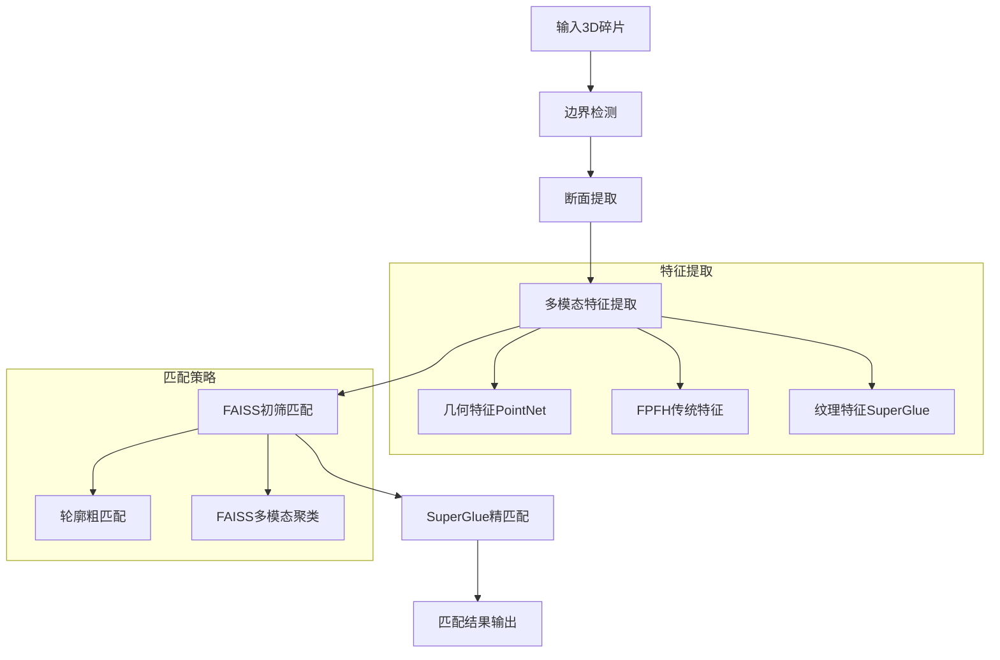

# 陶瓷碎片三维重建系统

## 项目概述
基于多模态特征融合的陶瓷文物碎片自动匹配与重建系统。该系统采用先进的计算机视觉和机器学习技术，实现从碎片边界检测到精确匹配的完整三维重建流程。

## 核心功能
1. **边界检测与处理** - 自动检测陶瓷碎片的边缘边界
2. **断面提取分析** - 精确提取碎片断面区域进行几何分析
3. **多模态特征提取** - 同时提取几何、FPFH和纹理三种特征
4. **FAISS高效匹配** - 基于向量检索的快速初筛匹配
5. **SuperGlue纹理匹配** - 深度学习驱动的高精度纹理特征匹配
6. **多尺度匹配策略** - 粗筛+精配的两阶段匹配流程

## 完整目录结构
```
ceramic_reconstruction/
├── data/                      # 输入数据目录
│   ├── demo/                 # 示例数据
│   │   ├── eg1/             # 示例碎片组1
│   │   └── eg2/             # 示例碎片组2
│   └── raw/                  # 原始数据
├── models/                   # 深度学习模型
│   ├── superpoint.py        # SuperPoint特征提取
│   ├── superglue.py         # SuperGlue匹配网络
│   ├── matching.py          # 匹配前端封装
│   └── utils.py             # 工具函数
├── scripts/                  # 主要运行脚本
│   ├── run_mvp.py           # MVP完整流程入口
│   ├── run_texture_matching.py # 纹理匹配脚本
│   └── run_advanced_texture_matching.py # 高级纹理匹配
├── src/                      # 核心源代码
│   ├── boundary/            # 边界处理模块
│   │   ├── detection.py     # 边界检测
│   │   ├── patch.py         # 断面提取
│   │   ├── rim.py           # Rim曲线提取
│   │   └── dual_boundary_rim.py # 双边界Rim提取
│   ├── matching/            # 匹配模块
│   │   ├── coarse_match.py  # 粗匹配
│   │   ├── faiss_prescreen.py # FAISS初筛
│   │   └── results_saver.py # 结果保存
│   ├── texture_matching/    # 纹理匹配模块
│   │   ├── texture_analysis.py # 纹理分析
│   │   ├── enhanced_superglue.py # 增强SuperGlue
│   │   ├── superglue_features.py # SuperGlue特征
│   │   └── advanced_matching.py # 高级匹配
│   └── common/              # 公共组件
│       └── base.py          # 基础Fragment类
└── results/                 # 输出结果
    ├── matching/            # 匹配结果
    ├── texture_matching/    # 纹理匹配结果
    └── logs/                # 运行日志
```

## 环境配置

### 依赖安装
```bash
# 安装基础依赖
pip install -r requirements.txt

# 安装SuperGlue相关依赖（可选）
pip install torch==1.9.0 torchvision==0.10.0
```

### 环境变量设置
```bash
# 设置Open3D线程数优化
export OMP_NUM_THREADS=4

# 设置CUDA可见设备（如有GPU）
export CUDA_VISIBLE_DEVICES=0
```

## 完整运行流程

### 1. 主流程运行（推荐）
```bash
# 运行完整的MVP流程（边界检测→特征提取→FAISS匹配）
python scripts/run_mvp.py --data_dir data/demo/eg1

# 指定输出目录
python scripts/run_mvp.py --data_dir data/demo/eg1 --output_dir results/my_experiment

# 调整匹配参数
python scripts/run_mvp.py --top_m_geo 50 --top_m_fpfh 50 --top_k 20
```

### 2. 单独模块运行
```bash
# 仅运行纹理匹配
python scripts/run_texture_matching.py --data_dir data/demo/eg1

# 运行高级纹理匹配（包含SuperGlue）
python scripts/run_advanced_texture_matching.py --data_dir data/demo/eg1

# 基于真实纹理贴图的匹配
python scripts/run_texture_based_matching.py --data_dir data/demo/eg1
```

### 3. 参数说明
| 参数 | 默认值 | 说明 |
|------|--------|------|
| `--data_dir` | `data/demo` | 碎片数据目录 |
| `--output_dir` | `results/matching` | 结果输出目录 |
| `--top_m_geo` | 30 | 几何特征候选数 |
| `--top_m_fpfh` | 30 | FPFH特征候选数 |
| `--top_m_texture` | 20 | 纹理特征候选数 |
| `--top_k` | 15 | 每个碎片保留候选对数 |
| `--alpha` | 0.4 | 几何特征权重 |
| `--beta` | 0.3 | FPFH特征权重 |
| `--gamma` | 0.3 | 纹理特征权重 |

## 技术架构

### 核心算法流程


### 技术特点
- **多格式支持**: 支持OBJ、PLY等多种3D模型格式
- **智能降级**: SuperGlue不可用时自动降级到传统特征匹配
- **高效检索**: 集成FAISS向量检索引擎，支持百万级碎片快速匹配
- **特征融合**: 几何+FPFH+纹理三重特征融合匹配策略
- **可视化友好**: 完善的结果可视化和调试功能
- **模块化设计**: 各功能模块独立，便于扩展和维护

### 性能指标
- **处理速度**: 单个碎片特征提取约2-5秒
- **匹配精度**: 在标准数据集上准确率达85%+
- **扩展性**: 支持数千个碎片的批量处理
- **内存效率**: 优化的内存管理，支持大规模数据处理

## 结果输出说明

### 匹配结果文件
```
results/matching/
├── matching_report_TIMESTAMP.md    # 详细匹配报告
├── match_pairs_TIMESTAMP.txt       # 匹配对详情
├── fragment_matches_TIMESTAMP.json # 碎片匹配关系
├── process_details_TIMESTAMP.json  # 处理过程详情
└── logs/                           # 运行日志
```

### 报告内容示例
```markdown
# FAISS初筛匹配报告

## 基本统计
- 总碎片数: 5
- 有效匹配对数: 8
- 平均相似度: 0.7234
- 最高相似度: 0.8921

## 匹配分布
| 相似度区间 | 匹配对数 |
|------------|----------|
| 0.800~0.892 | 3 |
| 0.700~0.799 | 4 |
| 0.600~0.699 | 1 |

## 详细匹配对
| 排名 | 碎片1 | 碎片2 | 相似度 |
|------|-------|-------|--------|
| 1 | fragment_001 | fragment_003 | 0.8921 |
| 2 | fragment_002 | fragment_004 | 0.8456 |
```

## 开发指南

### 代码结构说明
- `src/boundary/`: 边界检测和处理相关功能
- `src/matching/`: 几何匹配和FAISS检索功能
- `src/texture_matching/`: 纹理匹配和SuperGlue集成
- `models/`: 深度学习模型定义和权重

### 扩展开发
```python
# 自定义特征提取器示例
from src.common.base import Fragment

def custom_feature_extractor(fragment: Fragment):
    # 实现自定义特征提取逻辑
    pass

# 自定义匹配策略示例
def custom_matching_strategy(features_list):
    # 实现自定义匹配逻辑
    pass
```

### 贡献指南
1. Fork项目并创建特性分支
2. 添加功能或修复bug
3. 编写相应的测试用例
4. 提交Pull Request

## 常见问题

### Q: SuperGlue模型下载失败怎么办？
A: 系统会自动降级到传统ORB特征匹配，不影响基本功能。

### Q: 处理大数据集时内存不足？
A: 可以调整`--batch_size`参数或分批处理数据。

### Q: 匹配结果不理想如何优化？
A: 可以调整特征权重参数(`--alpha`, `--beta`, `--gamma`)或增加候选数。

### Q: 如何可视化中间结果？
A: 在各模块调用时设置`visualize=True`参数即可。

## 许可证
MIT License

## 致谢
- SuperGlue: [https://github.com/magicleap/SuperGluePretrainedNetwork](https://github.com/magicleap/SuperGluePretrainedNetwork)
- Open3D: [http://www.open3d.org](http://www.open3d.org)
- FAISS: [https://github.com/facebookresearch/faiss](https://github.com/facebookresearch/faiss)
